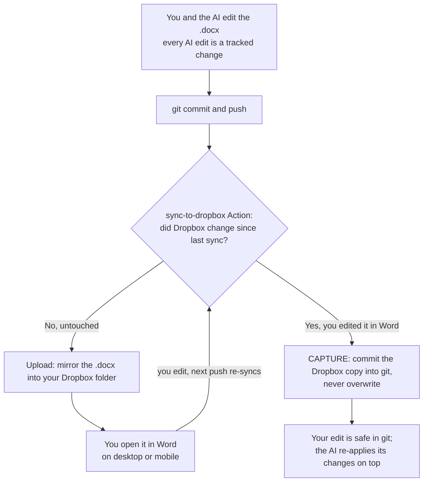

# GitDoc | Word Tracked Change Manager

**A boilerplate for writing long-form documents — papers, dissertations, articles —
with an AI collaborator whose every edit is a reviewable Word tracked change,
version-controlled in git, released like software, and synced to storage you open
in Word anywhere.**

Clone this into your own repo, open the AI of your choice, tell it what you're
writing (or just talk through your goals), and it sets up your first `.docx` and
the basic settings. From then on the AI drafts and revises your manuscript as
**Word revisions you Accept or Reject** — never an opaque rewrite — while git keeps
the history and named versions, and an optional sync mirrors the file to a storage
folder you open in Word on your desktop or phone.

## Who this is for

Anyone doing long-form writing who wants an **external, permanent AI thought-organizer**
that helps with structure, formatting, and references without taking the pen out of
your hand:

- A PhD student drafting a dissertation.
- A researcher writing a paper with many cross-references and a moving argument.
- Anyone maintaining a manuscript they want to review, version, and keep durable.

Writing for a venue that **restricts AI-written text** ? GitDoc
has an **author-writes mode**: the AI scaffolds structure, sources, and fact-checks
and leaves `[[WRITE: …]]` markers, but *you* write the prose — so the words stay
yours. See [`AGENTS.md`](AGENTS.md).

## Why it works

- **Reviewable, not opaque.** Changes are real `<w:ins>`/`<w:del>` Word revisions
  carrying an author and date, so you Accept/Reject them in Word like any human
  editor's. Edits that belong to one decision share an author string, so a whole
  change accepts or rejects as a group.
- **Versioned like software.** The document lives in git. You declare *share-points*
  as releases (`0.1.0`, `0.2.0`, …) — a version is a milestone you choose to send
  out, not a bump per keystroke.
- **Durable.** Git history plus a plain-text worklog beats a lone binary lost in a
  cloud folder.
- **Openable anywhere.** An optional, binary-safe sync mirrors your `.docx` to a
  storage folder (Dropbox reference implementation included) you open in Word on
  desktop or mobile. If you edit it there, your change is *captured into git*, never
  overwritten.

### What that feels like in practice

You decide to cut a construct from your paper — but it's referenced across four
paragraphs on three pages. One instruction to your AI, and every mention is removed
as tracked changes you can review. Accept them together, and the manuscript moves
from `0.1.0` to `0.2.0` as **one** decision instead of a dozen scattered edits.

## How it fits together

- **Placeholder markers** let the document carry its own to-do list — `[[WRITE: …]]`
  for content to draft, plus `CITE / VERIFY / REF / NOTE / Q / CUT?` for sources,
  facts, references, private notes, questions, and deletion candidates. The
  *blockers* (`WRITE/CITE/VERIFY/Q/REF`) must be cleared before you share; a one-line
  lint (`scripts/check_tags.py`) enforces it. Full spec + live tracker:
  [`PLACEHOLDERS.md`](PLACEHOLDERS.md).
- **Decisions** are the unit of work: one coherent, document-wide edit, grouped under
  a single author label so it accepts/rejects as a group in Word.
- **Versions** are share-points *you* declare (`0.1.0 → 0.2.0`); the AI suggests when
  to cut one so they stay small, and rolls the decisions into a `CHANGELOG.md` entry
  whose commit links double as your recovery index. See
  [`docs/workflow.md`](docs/workflow.md).

## Quick Start

> Full walkthrough: [`docs/getting-started.md`](docs/getting-started.md).

1. **Make it your repo.** Click **Use this template** on GitHub (or fork/clone),
   then create a repo for *your* manuscript.
2. **Clone and install.**
   ```bash
   git clone https://github.com/<you>/<your-repo>.git && cd <your-repo>
   pip install -r requirements.txt
   ```
3. **Open your AI in the repo** (Claude Code, or any coding agent). It reads
   [`AGENTS.md`](AGENTS.md) and offers to onboard you. In Claude Code, just run
   **`/gitdoc-setup`** — the setup skill drives the whole thing.
4. **Tell it what you're writing** — the doc type, the topic, a rough structure — or
   just talk through your goals. It bootstraps your `.docx` (with `[[WRITE: …]]`
   markers for anything to fill later) at version `0.1.0`.
5. **Draft as tracked changes.** Ask for edits; review them in Word; Accept/Reject.
   Commit as you go.
6. **(Optional) Turn on storage sync.** Follow
   [`docs/setup-dropbox.md`](docs/setup-dropbox.md) to mirror the file to a folder
   you open in Word — [`.env.example`](.env.example) is the one-glance checklist of
   which keys go where. Skip this and everything still works in git.
7. **Cut versions.** When a draft is a share-point, tag a release (`0.2.0`) and note
   it in [`CHANGELOG.md`](CHANGELOG.md).

Ready-made first prompts, depending on how you like to work:
- [`docs/setup-prompt.md`](docs/setup-prompt.md) — paste into a fresh chat with the
  repo attached and let the AI **lead**: read the repo, interview you, set it up.
- [`docs/kickoff-template.md`](docs/kickoff-template.md) — you **fill in the blanks**
  up front and hand the agent a complete brief.
- [`docs/migrate-prompt.md`](docs/migrate-prompt.md) — already been **working the
  paper out in a chat**? Formalize that discussion into a GitDoc document, in place.

## What's inside

| Path | Role |
| --- | --- |
| [`AGENTS.md`](AGENTS.md) | Standing instructions any AI reads on clone: onboarding + editing + versioning rules. |
| [`PLACEHOLDERS.md`](PLACEHOLDERS.md) | The marker vocabulary (`WRITE/CITE/VERIFY/REF/NOTE/Q/CUT?`) + the live placeholder tracker. |
| `scripts/docx_tracked_changes.py` | Create a `.docx`; apply tracked changes matched on visible text; simulate Accept-All / Reject-All to verify. |
| `scripts/check_tags.py` | Pre-share lint: fails if any blocker marker still survives Accept-All. |
| `scripts/dropbox_sync.py` | git↔storage sync with conflict **capture** (never clobbers a storage-side edit). |
| `.github/workflows/sync-to-dropbox.yml` | Runs the sync on push (binary-safe, via the storage HTTP API). |
| `docs/getting-started.md` | The human quick-start walkthrough. |
| `docs/workflow.md` | The authoring model: chat-vs-doc, decisions, versioning, the suggestion engine. |
| `docs/setup-prompt.md` | Copy-paste prompt: let the AI lead setup in a fresh chat with the repo attached. |
| `docs/kickoff-template.md` | Copy-paste first prompt where you fill in the details up front. |
| `docs/migrate-prompt.md` | Copy-paste prompt: formalize an existing chat discussion into a GitDoc document. |
| `docs/tracked-changes.md` | The tracked-changes API and rules. |
| `docs/editing-protocol.md` | One-writer-at-a-time rule that prevents "conflicted copy" files. |
| `docs/setup-dropbox.md` | One-time storage app + offline token + secrets setup. |
| `.claude/skills/gitdoc-setup/` | Claude Code skill: onboard a new writer and bootstrap their doc (run `/gitdoc-setup`). |
| `.claude/skills/tracked-doc-sync/` | Claude Code skill: the tracked-changes editing API. |
| `examples/quickstart.py` | Runnable end-to-end demo of the tracked-changes loop. |

## Pairing with LitParser (optional)

GitDoc has a companion — **[LitParser](https://github.com/Jtread0000/LitParser)** —
a literature engine that turns a pile of PDFs into a structured, cited knowledge base
(a `lit.yaml` source of truth, open-access PDF fetching, PDF→Markdown conversion, and
generated reading-list / APA-reference views). The two connect through **one seam**:
the `[[REF: id]]` marker. A `REF` id points at a LitParser record, so your AI can
surface a source from your knowledge base and drop the verified citation into the
manuscript on request.

The coupling is deliberately thin — GitDoc needs nothing from LitParser to work, and
`[[REF: id]]` behaves as an ordinary blocker marker when no `lit.yaml` is present. Use
either template alone, or drop LitParser's `Lit/` tree into a GitDoc project to get
reference injection. (LitParser is a separate "Use this template" repo; the link goes
live once it's published.)

## Storage sync (Dropbox)

Your document is version-controlled in **git** no matter what. Storage sync is an
optional layer on top so the live `.docx` lands in a folder you open in **Word** on
desktop or mobile. The included implementation targets **Dropbox** and runs in
**GitHub Actions** — it speaks the Dropbox HTTP API directly, so it handles binary
`.docx` files that most connectors refuse.

### Giving GitHub Actions permission to write to Dropbox

The Action needs to write to your Dropbox on its own, without a human re-authorizing
each run. You grant that **once**:

1. Create a **Dropbox app** (scoped access) with `files.content.read/write` +
   `files.metadata.read`.
2. Do the one-time OAuth exchange to get an **offline refresh token** (it lets the
   Action mint short-lived access tokens forever).
3. Add three **repository secrets** — `DROPBOX_APP_KEY`, `DROPBOX_APP_SECRET`,
   `DROPBOX_REFRESH_TOKEN` — and one **variable**, `DROPBOX_DEST_DIR` (your target
   folder). The workflow stays completely inert until those exist, so nothing breaks
   before setup.

Full step-by-step (with the exact URLs and the token exchange) is in
**[`docs/setup-dropbox.md`](docs/setup-dropbox.md)**; the key-by-key checklist is
[`.env.example`](.env.example). Secrets are yours to add — an agent can't set them.

### The full loop (and how it prevents data loss)

A `.docx` is **binary** — it can't be merged like text. So the sync never blindly
overwrites: on each run it compares Dropbox's version fingerprint to the last one it
wrote. If you edited the file in Word, it **captures** that copy into git instead of
clobbering it.



**One writer at a time.** Because two people (you in Word, the Action on push) can't
safely write the same binary at once, the rule is one writer at a time: say
"hands off" and the agent captures your Dropbox edits into git before it touches the
file again. Details: [`docs/editing-protocol.md`](docs/editing-protocol.md). The
upshot — **no edit is ever silently lost**; a conflict becomes a git commit, not a
`(conflicted copy)` file you have to reconcile by hand.

### More backends coming

Dropbox is the first sync target, not the only planned one — additional storage
backends (e.g. Google Drive, OneDrive) are on the roadmap. The sync is one small
script (`scripts/dropbox_sync.py`); until then, you can adapt its upload/download
calls to another provider's API and keep the rest. Tracked in the issues.

## License

MIT — see [LICENSE](LICENSE). Fork it, adapt it, share it with your cohort.
